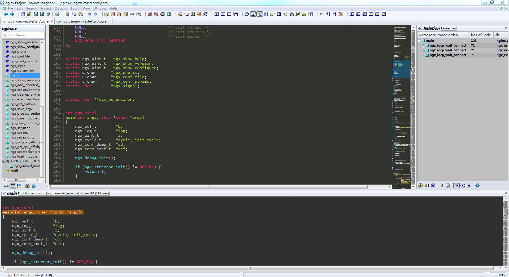
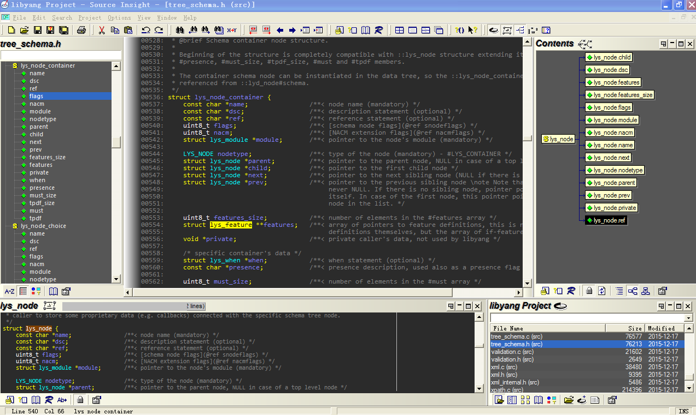

# source-insight-config
My Source Insight configuration files (Themes).

## Configuration Files

- Source Insight 4.x: [monkey-king-dark-si4.xml](./monkey-king-dark-si4.xml)
	* Snapshort:

- Source Insight 3.x: [Monkey-King-dark.CF3](./Monkey-King-dark.CF3)
	* Window Background: (43,43,43),(86,86,86)
	* Font: Consolas
	* Snapshort:

## Installation

Source Insight -> Option -> Load Configuration
